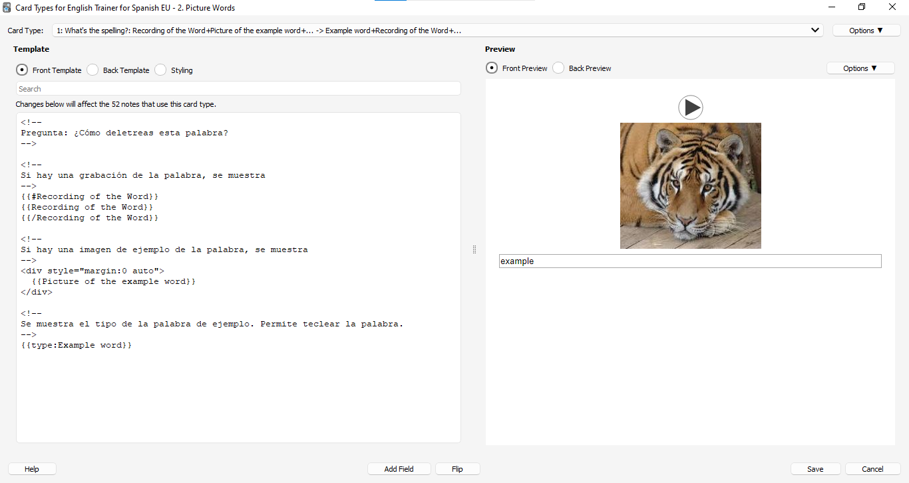
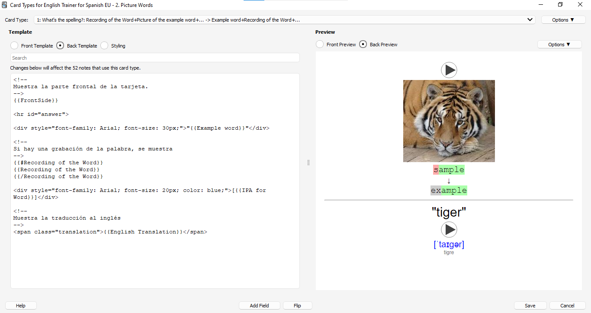

# ANKI_Vocabulary_Basic_Food_Colors_Animals
Repositorio de Anki para el estudio de idiomas con tarjetas personalizadas, grabaciones de audio y plantillas optimizadas. Mejora tus habilidades lingüísticas de forma efectiva. Uso personal, no comercial.

## Capturas de Pantalla

## Características

Enumera las características clave de tu repositorio, como:

- Mazos de tarjetas organizados por temas
- Diseño personalizado de las tarjetas
- Contenido basado en fuentes confiables

## Requisitos
- Anki: Version ⁨2.1.60 (última versión en que fue usado)

## Instalación

Proporciona instrucciones claras y concisas sobre cómo instalar y utilizar tu repositorio. Puedes incluir comandos o enlaces a recursos adicionales.

## Licencia

MIT License.
