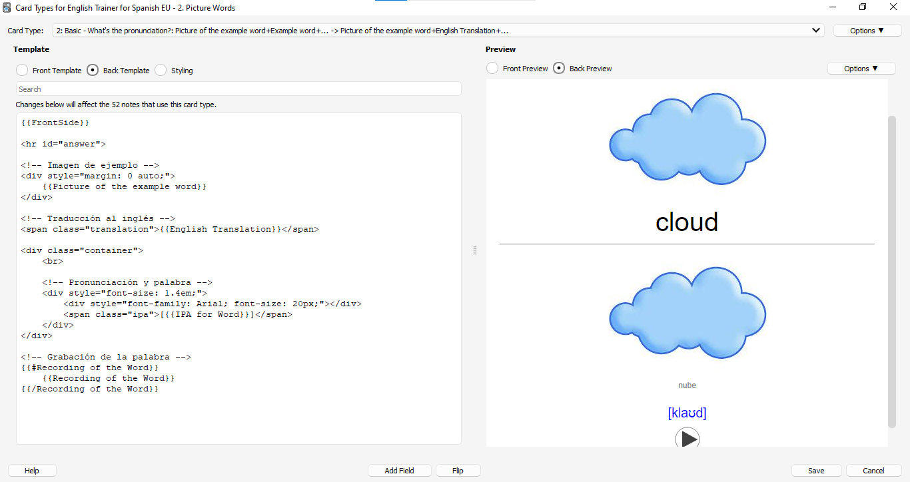

# ANKI_Vocabulary_Basic_Food_Colors_Animals

Repositorio de Anki para el estudio de idiomas con tarjetas personalizadas, grabaciones de audio y plantillas optimizadas. Mejora tus habilidades lingüísticas de forma efectiva. Uso personal, no comercial.

## Notas de Uso y Licencia:

Este mazo de Anki está diseñado para ayudar en el aprendizaje del vocabulario básico de inglés.

Las tarjetas y contenido incluido en este mazo son proporcionados "tal cual" y no hay garantía de su exactitud o completitud.

Las imágenes y archivos de audio utilizados en este mazo se han obtenido de fuentes públicas disponibles, por lo que se presume que son de libre uso. Sin embargo, no se dispone de información sobre su origen o licencias originales. 

Este mazo se proporciona de forma gratuita para su uso exclusivamente con fines educativos y de aprendizaje. Puedes distribuirlo como material de enseñanza, siempre y cuando no tengas ningún objetivo comercial asociado.

Licencia: MIT License.

## Requisitos

- Anki: Version ⁨2.1.60 (última versión en que fue usado, debería funcionar también en versiones superiores)

## Instalación

1. Descarga el mazo, es el archivo "Vocabulary - Basic Food, Colors, Animals.apkg". También puedes clonar todo el repositorio si lo prefieres.
2. Abre Anki: Inicia la aplicación Anki en tu computadora.
3. Importa el mazo: En la pantalla principal de Anki, haz clic en "Archivo" en la barra de menú superior y selecciona "Importar". Busca el archivo del mazo que descargaste y selecciónalo. Haz clic en "Abrir" para comenzar el proceso de importación.

## Características

Este mazo de Anki consta de dos notas por palabra. La primera muestra una imagen y un archivo con la pronunciación de la palabra. El usuario puede escribir la palabra correspondiente. Cuando comprueba su respuesta, se muestran la palabra que escribió y la palabra correcta. Los aciertos se muestran en verde y los errores en rojo. 

En la segunda nota, se muestra la imagen que representa la palabra y la propia palabra. El usuario intentará pronunciarla lo mejor que pueda. Después de completar la prueba, el usuario podrá escuchar la pronunciación correcta y repetir el sonido para verificar su pronunciación las veces que desee.

## Capturas de Pantalla

### Tarjeta (Card) 1: ¿Cómo deletreas esta palabra?

### Tarjeta (Card) 2: ¿Cómo pronuncias esta palabra?

## Lista de palabras

| Palabra           | Significado        |
|-------------------|--------------------|
| red               | roja,o             |
| green             | verde              |
| horse             | caballo            |
| dog               | perro              |
| sun               | sol                |
| milk              | leche              |
| rain              | lluvia             |
| hungry            | hambriento         |
| cat               | gato               |
| wind              | viento             |
| yellow            | amarillo           |
| cloud             | nube               |
| temperature       | temperatura        |
| egg               | huevo              |
| gray              | gris               |
| sugar             | azúcar             |
| apple             | manzana            |
| fly               | mosca              |
| orange (fruit)    | naranja            |
| knife             | cuchillo           |
| lion              | león               |
| thirsty           | tener sed          |
| sweet             | dulce (sabor)      |
| chicken (food)    | pollo              |
| butterfly         | mariposa           |
| blue (color)      | azul               |
| pink              | rosa, rosado       |
| snake             | serpiente          |
| white             | blanco,a           |
| black             | negro              |
| color             | color              |
| brown             | marrón, café (color)|
| bee               | abeja              |
| tiger             | tigre              |
| weather           | clima              |
| orange (color)    | naranja            |
| purple            | morado             |
| puppy             | cachorrito         |
| light (color)     | claro, tenue       |
| fork              | tenedor            |
| spoon             | cuchara            |
| taste             | saborear           |
| ice cream         | helado             |
| dark (color)      | oscuro,a           |
| bacon             | tocino, beicon     |
| cereal            | cereal             |
| sausages          | salchichas         |
| unicorn           | unicornio          |
| grapes            | uvas               |
| cherries          | cerezas            |
| pear              | pera               |
| olives            | olivas, aceitunas  |

